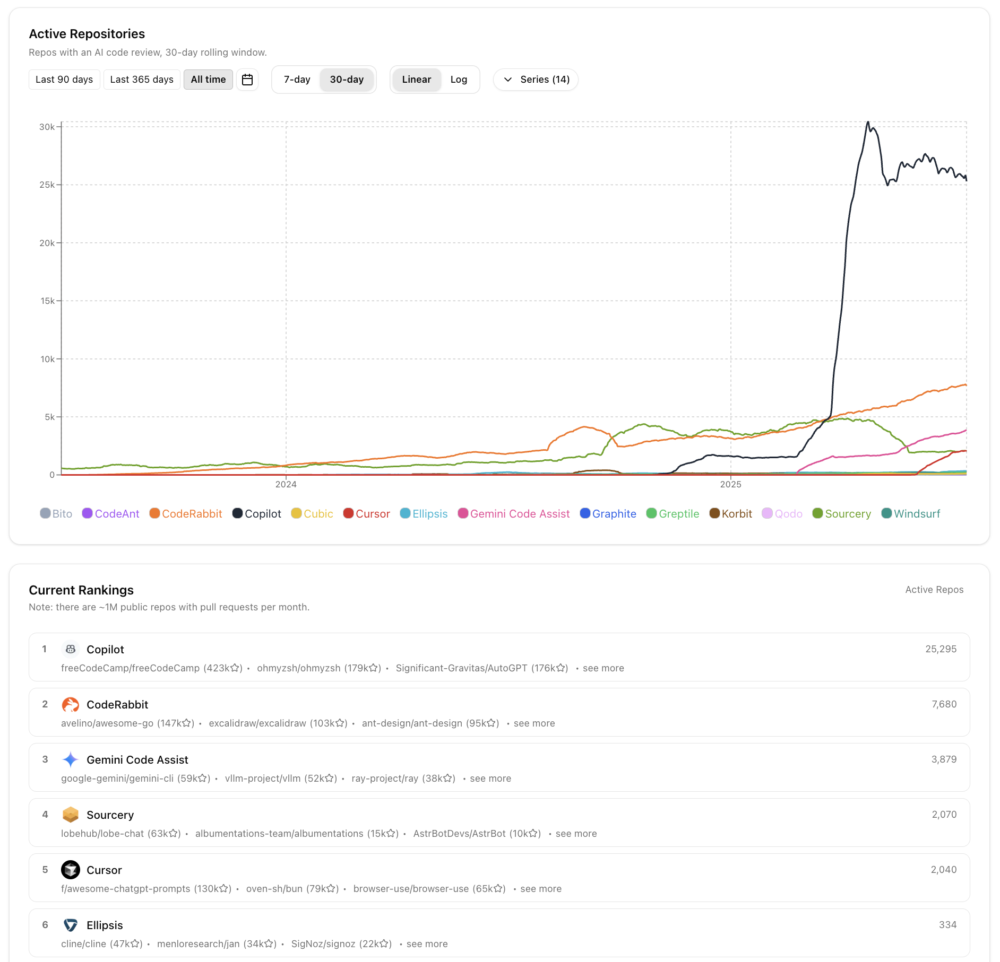

# ✨ AI Code Review Adoption Tracker
A dashboard tracking the adoption of AI code review tools across open-source GitHub repositories.

View at [https://www.aitooltracker.dev](https://www.aitooltracker.dev).



## How it works

⚠️ **Warning**: Work in progress. This project was vibecoded and should not be used as an example of good engineering practices. It has not been thoroughly validated. Do not make any important life decisions based on this dashboard.

The data pipeline runs daily for the previous day, and has been backfilled from July 2023 onwards.

- List of tracked devtools is in [devtools.json](/src/devtools.json)
- Data source: [GH Archive](https://www.gharchive.org/)'s BigQuery dataset. **We currently only search over PR Review events.**
- Cron job: uses [Trigger.dev](https://trigger.dev/) every day at 5am UTC to process the previous day's data archive (which is usually uploaded a few minutes after midnight UTC)
- Storage: [Neon](https://neon.com/) serverless postgres to store intermediate data and materialized views for window aggregates.
- Frontend: NextJS, Tailwind
- Hosting: Vercel

**Why only scan for PR review events?** In GitHub, every PR is an Issue, so top-level comments are technically Issue Comments, which are distinct from top-level PR Reviews (which have an optional Body) and PR Review Comments (which are inline at a location on the diff, and associated with a Review). This means that if a bot leaves its review in the form of an issue comment instead of a true review, it'll be missed. However, issue comments get used for many other purposes ("trial expired" messages, summaries, etc), so ignoring them is safer on net.

## Roadmap

- Potentially try DuckDB + Modal instead of using BigQuery: https://noreasontopanic.com/p/querying-billions-of-github-events
- OpenAI data not showing up after Aug 28?
  - Weird, bot `chatgpt-codex-connector[bot]` with id `199175422` still seems active, see https://github.com/nsbradford/ai-devtool-leaderboard/pull/32#pullrequestreview-3188009219
- Claude is not showing up anymore? (some issues there bc Claude is done through GitHub actions, unclear if there's an easy way to track)
- More data to track
  - Number of unique active users
  - Number of unique PRs reviewed
  - when repos stop using a tool (it stops showing up on new PRs)
  - Display all repos for each tool, not just the top 10
- Other kinds of tools to track
  - Code generation
  - ...

## Local development

### Prerequisites

- Node.js 18+
- pnpm (recommended) or npm
- PostgreSQL database (for data storage)
- Google Cloud BigQuery access (for data processing)

### Setup

1. **Clone the repository**

   ```bash
   git clone https://github.com/nsbradford/ai-devtool-leaderboard.git
   cd ai-devtool-leaderboard
   ```

1. **Install dependencies**

   ```bash
   pnpm install
   ```

1. **Environment configuration**

   ```bash
   cp .env.local.example .env.local
   ```

   Fill in the required environment variables.

1. **Start the development server**

   ```bash
   pnpm dev
   ```

1. **Open the application**
   Navigate to [http://localhost:3000](http://localhost:3000)

### Available scripts

- `pnpm dev` - Start development server with Turbopack
- `pnpm build` - Build for production
- `pnpm start` - Start production server
- `pnpm lint` - Run ESLint
- `pnpm format` - Run Prettier

# Adding a new bot

First, find an example of the bot out there in the wild to get its username (e.g. `cursor[bot]`). Then, use this command to get the bot's actual ID:

```bash
# for `cursor[bot]`:
curl -s -H "Accept: application/vnd.github.v3+json"  "https://api.github.com/users/cursor%5Bbot%5D"
```

Then add relevant data to `src/devtools.json`:

```json
{
  "id": 206951365,
  "account_login": "cursor[bot]",
  "name": "Cursor",
  "avatar_url": "https://avatars.githubusercontent.com/in/1210556?v=4",
  "website_url": "https://cursor.com",
  "brand_color": "#dc2626"
}
```

Once the PR is open, @nsbradford will run backfill data for that bot. Warning: it gets expensive to scan the entire BigQuery table, so be careful.

```bash
pnpm run backfill-bot-reviews --start 2025-01-01 --end 2025-05-01

# Slightly more efficient to set your bot's `brand_color` to `#000000` and then run backfill with `--new-bots-only`.
pnpm run backfill-bot-reviews --start 2025-01-01 --end 2025-05-01  --new-bots-only
```

## License

This project is open source and available under the [MIT License](LICENSE).

test strib PR
